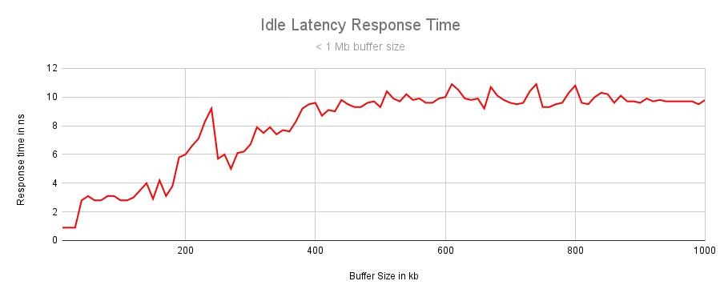
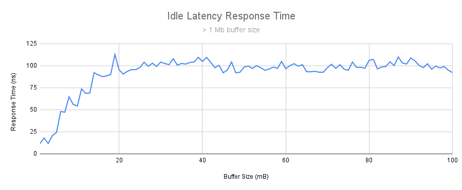
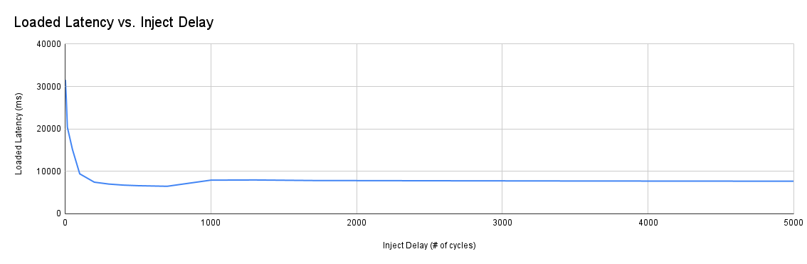
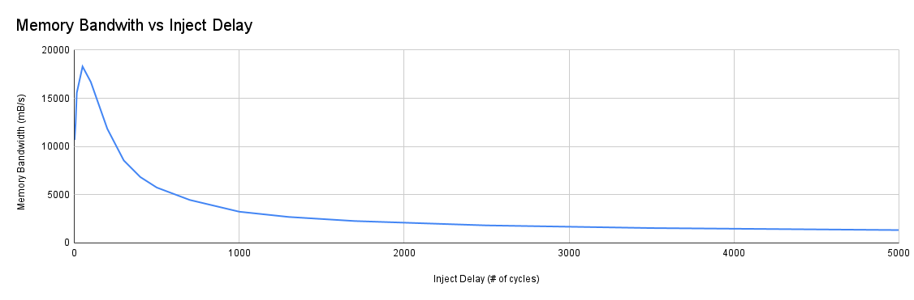
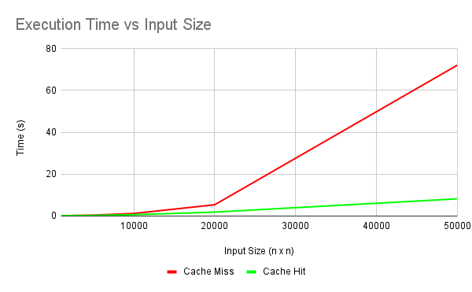

# Project 1 : Cache and Memory Performance Profiling

## Overview
### Introduction
In this project, I designed a series of experiments to determine experimentally the varied performance of memory and caching in software, and how they affect software performance. Specifically I measured the latency and bandwidth under various conditions, and the effect of cache-miss rates on performance.

### Queuing Theory
Queuing theory is the study of "queues" or "lines". In our case we are focused on how it predicts the affects on latency and bandwidth on a CPU. Latency is the time it takes for the CPU to retrieve something from that level of memory, be it an instruction or a piece of data. Bandwidth is the amount of "things" that can be retrieved in a unit of time. From our understanding of queuing theory, we are predicting that we should see a negative relationship between bandwidth and latency. If we are asking for more data, it should take longer, and if we are asking for no data, the latency should be minimized. 

### Testing Environment
* System : Thinkpad P15s Gen. 2
* Memory : 16 GB DDDR4
* CPU : Intel Core i7-10610U
* OS: Ubuntu 22.04 x86_64

## Experiment 1 - Latency of Cache and Main Memory with Zero Queue Length
### Procedure
In order to determine the non loaded latency, the *Intel Memory Latency Checker* was utilized. The "idle_latency" test suite allows the determination of the latency of accessing memory stored in a buffer of a variable size. By adjusting the size of the buffer the level in the memory hierarchy we are targeted can be changed. A very small buffer will reside nearly entirely in the L1 cache, while a very large buffer will reside nearly entirely in the main memory. 

A script (*bufferLatency.sh*) was written to vary the buffer size from *1-1024kB*, and *1-100Mb*

### Results

*Generated from L1-L3.txt*

*Generated from ram.txt*

### Analysis 

Observing the response time as we vary the buffer latency, we can see various "flat" sections, where we assume we are hitting a single level of the memory hierarchy, and various sloped areas, where we assume that we are moving between areas. We **don't** see a smooth transition, because the buffer can be half in a memory layer. If it's half in the L2 layer, and half in the L1 layer, we will get a value in between the two for latency.

These flat sections occur around <100kb, 100kb-256 kB, 256kb - 1mB, and > 20mB. We can assume these correspond to the L1, L2, L3 and Main memory levels respectively.

By determining the model of the CPU used in the test environment ( *Intel Core i7-10610U* ), we can determine the actual sizes of the caches in the system. They are as below

|Cache| Size|
|-----|-----|
|L1| 64 kB|
|L2| 256 kB|
|L3| 8 mB|

Comparing our "flat" areas to these values, we can see that while the non smooth transitions obscure the ability to determine the exact values, we did find latency values corresponding to these rough ares of size.

Our rough observed values are as such
|Level| Latency|
|-----|--------|
|L1   | ~1 ns  |
|L2   | ~5 ns  |
|L3   | ~10 ns |
|DRAM | ~100 ns|

## Experiment 2 - Maximum Bandwidth of Main Memory
### Procedure
In order to determine the maximum bandwidth of the main memory under different read vs. write intensity ratios, and different data granularities, the *Intel Memory Latency Checker* was used. The maximum bandwidth test was used, with 3 different "stride" options, and 5 different read/write options. The results are shown below.

### Results

| Write / Read Intensity | 64 Byte Stride | 256 Byte Stride | 1024 Byte Stride | 
|------------------------|----------------|-----------------|------------------|
| All Reads | 8268.63 | 12635.94 | 18711.11 |
|3:1 Reads-Writes | 6305 | 9866.66 | 11606.38 |  
|2:1 Reads-Writes | 8502.88 | 11606.38 | 15778.38 | 
|1:1 Reads-Writes | 10194.92 | 13268.37 | 14115.84 |
|Stream-Traid Like | 8175.11 | 12811.56 | 15856.7|

### Analysis 

In general we observed the following trends in the data sets extracted from the experiment. 

* Going across the data set, keeping the granularity the same, and changing the stride, we observe that the memory bandwidth increases. This implies that a larger data granularity gives us a greater memory bandwidth, which is what we can expect to see. Reading data in larger chunks resulting in larger bandwidth.
* As we decrease the ratio of reads to writes, that is to say we have closer to a 1:1 read:write rather than a 3:1 read:write, we see that the memory bandwidth increases.

## Experiment 3 - Trade-off between read/write latency and throughput of the main memory
### Procedure
In order to determine the trade-off between read/write latency and throughput of the main memory, the "loaded_latency" test from *Intel Memory Latency Checker* was used. This generated a large amount of arbitrary loads on the memory, and then slowly increased the delay between these loads, simulating a decreasing load on the memory.

### Results

### Analysis 
We can observe a couple of trends in the data.
* The first is that as the inject delay increases, the bandwidth decreases. This is to be expected, as a larger delay between injecting reads/writes means more time spent waiting for the data. The bandwidth continues to decrease as we increase the inject delays, which is what we would expect.
* As the inject delays are increased, the latency decreases until it reaches a "plateau" point. This makes sense, as at certain point the bandwidth of the memory is no longer limiting the reads/writes, instead the data is simply limited by the latency to the memory. As this does not change once the bandwidth is no longer saturated, it should stay constant.
* At low injection delays, we see a very high bandwidth, but also a very high latency. This **matches** what we expect to see from the queuing theory, that as we increase the arrival rates, the latency increases. Therefore in order to get a balance of high bandwidth and low latency, we need to exist somewhere in the middle of these two extremes, as we've shown that bandwidth and latency are trade-offs.

## Experiment 4 - Impact of Cache Miss Ratio on Software Speed Performance

### Procedure
In order to determine the effect of cache miss ratio on software speed performance, a simple code segment was written to simulate different load's on the cache. This code segment can be found in *cache-hit.cpp* and *cache-miss.cpp*. The code allocates a matrix of *n*x*n* size, and fill's it with the value 1. In order to simulate load on the cache, the code then iterates through this matrix, summing up the values. By changing the way we iterate, either down a allocated memory section, or across multiple, we can change the level of temporal locality, and therefore the cache performance.

We test the cache miss rate, and the time to run, using a variety of different matrix sizes, and extract the results using the Linux *perf* command.

### Results
#### Cache Miss Load 
| Input Size | Cache Miss Rate | Time |
|------------|-----------------|------|
| 1000       | 9.71%           |0.011s|
| 5000       | 10.94%          | 0.28s|
|10000       | 12.77%          |1.07s |
|20000       | 12.76%          |5.26s |
|50000       | 12.72%          |72.14s|

#### Cache Hit Load 
| Input Size | Cache Miss Rate | Time |
|------------|-----------------|------|
| 1000       | 1.52%           |0.02s |
| 5000       | 00.91%          |0.12s |
|10000       | 00.90%          |0.49s |
|20000       | 00.87%          |1.73s |
|50000       | 00.81%          |8.1s  |
#### Comparative Time

### Analysis 
There are two trends that can be seen in the data
* The first trend is the increasing time for the code sample to execute. Both the *cache-miss* and *cache-hit* load show an increase in the processing time as the input size increases. This is to be expected. But the difference between the rate of increase is what shows the cache performance.
    The *cache-hit* load increases at a much slower rate than the *cache-miss* load, to the point that the *cache-miss* load has a time to process 10x that of *cache-hit* at the end of the input set. This is the result of the high cache miss rate slowing down the performance significantly, demonstrating the effect we are trying to show.

* The second trend, which is less relevant to the purpose of this experiment, but is still observable, is that the cache miss and hit rates tend to "flatten" out as the input size increases. This can be explainable that once the matrix reach's a certain size, the ratio between number of rows, and elements, is no longer increasing at the same rate. As the transition between rows is what is causing the cache misses, we can expect the rate of cache misses to also begin to flatten.

## Experiment 5 - Impact of TLB table miss ratio on Software Speed Performance
### Procedure
The same code sample was used as before, as it was observed that that the same code produced a reliable higher rate of TLB misses on one load, and a much lower rate of misses on another load. The code was again measured at different input rates, and the time and TLB miss measured using the Linux *perf* utility. 

### Results

#### TLB Miss Load
| Input Size | TLB Miss Rate | Time |
|------------|-----------------|------|
| 2000       | 10.83%           |0.04s |
| 5000       | 5.81%          |0.27s |
|10000       | 5.92%          |1.11s |
|20000       | 5.85%          |5.27s |
|50000       | 5.76%          |66.91s  |

#### TLB Hit Load
| Input Size | TLB Miss Rate | Time |
|------------|-----------------|------|
| 2000       | 1.93% |0.06s |
| 5000       | 0.01%|0.16s |
|10000       |0.01% |0.45s |
|20000       |0.01% |1.73s |
|50000       |0.01% |8.19s  |

### Analysis 

As the translation look ahead buffer is effectively acting as a cache for the CPU virtual memory, it's not unsurprising that we see similar trends to the previous cache experiment. We see a signifiant increase in time to process the larger input loads, and a clear link between TLB miss rate, and time. We also see a very similar trend in the miss rate flattening out that we saw in the previous cache rate, for similar reasons.

## Conclusion 
In the case of our experiments we observed a couple of features that can help us when writing code to maximise the usage of the underlying hardware. The first was the effect that different caching had on the performance. Having a better cache hit ratio significantly increased performance, in addition, sizing the cache properly can also help with that hit ratio tremendously. A harder one to apply, but just as important, was the trade-off between memory bandwidth and latency, and that in order to maximise the memory performance, we need to strike a balance between the two.
