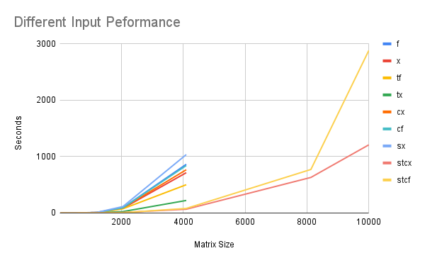

# Project 1 : Matrix-Matrix Multiplication

## Overview
### Introduction
In this project, I explored three different optimization techniques on Matrix Multiplication. Multi-threading, Cache Optimization, and SIMD Instructions. The three techniques were implemented in a C++ module that is capable of enabling each technique individually, as well as being able to handle n-size matrices of fixed and floating data types. In addition to the implementation, the effect of the different optimization techniques, as well as the 16 different combination of fixed/floating with multiple optimization techniques are analyzed. The effect's were measured experimentally, and then I endeavored to explain those effects.

### Usage

The module requires a command line to use. It needs to be compiled with the g++ compiler, using the below line.

Compile line:
```g++ *.c *.a -march=native -o proj2```

Execute using:
```./proj2 <args> seed matrixSize```

Arguments: <br>
`<args>`
`-x/f` : Specifies which data type to use (`f` for floating, `x` for fixed) <br>
`-c` : Enables the cache optimization techniques <br>
`-s` : Enables the use of the SIMD multiplication technique <br>
`-t` : Enable the multi-threading <br>
`-p` : Print's the matrix before and after <br>

`seed` : Set's the seed for the C random number generator <br>

`matrixSize` : Set's the matrix size of `matrixSize`x`matrixSize`:w <br>


### Code Design Decisions
With 3 different techniques for optimization, and two different data types to handle, there are a possible of 2^4 different paths the code can take down when multiply to address all the different combination of data and optimization techniques. While feasible to do so, it not preferred for maintainability or readability to write all all 16 code implementations in code. In addition, it would take much longer to implement. As such there are two goals we keep in mind when designing our C++ module, correct implementation of the optimization techniques, and reusability and modularity of the optimization techniques. Below I have outlined how I achieved these goals for the various parts of the module.

#### Fixed Vs Floating
In order to implement the two different data types, C++ heavily templating was used. This allowed a single C++ template of a `Matrix` to cover the majority of difference between the two, with only a few methods needing to be specialize out. This use of templating is a heavy theme throughout the code design, as well as the blackboxing of various portions of the code.

#### Cache Optimization
The use of a `Matrix` class allowed the internal representation of the data to be mostly blackboxed. The code handling multiplication does not know the if the Matrix it is multiply is set up for efficient access or not. We have two internal representation, "row-major" and "column major". The naive implementation is both Matrix in A*B=C are both in Row Implementation. Putting A in "row-major" and B in "column-major" increases the access efficiently by a considerable degree.

Keeping the internal representation hidden means we don't have to code additional multiplication methods for cache-optimized vs not.

#### Multi-Threading
The primary observation we use to increase code reuse is that by having a dynamic number of threads in our code, we can either have 1, or >1 to enable / disable multi-threading. We split the matrix up by columns, and have each thread calculate an output column. If we don't have multi-threading, we limit it to 1 thread at a time. This way, we assume threading always, and only need a single multiply method.

The p-thread library is used to implement multi-threading.

#### SIMD vs Traditional C Instructions
This is where we have the most difficulty with code reuse. The C instruction is easy to template, so we only have to write a single method for it. However, the SIMD version requires different SIMD calls for floating and fixed, so we need to spit that. In total, we have to have three different splits in the code path for SIMD Float vs SIMD Fixed vs C instructions. However, as these are only split points in our entire multiplication code, it's still significantly better than 16 combinations if each technique combination was coded.

## Experimental Results

### Hardware
* System : Thinkpad P15s Gen. 2
* Memory : 16 GB DDDR4
* CPU : Intel Core i7-10610U
* OS: Ubuntu 22.04 x86_64
* Supported SIMD : AVR2, AVR, SSE

## Analysis 

### Experimental Results
In order to measure the effect of the various input matrix were tested, against various optimization combinations, to determine which optimizations worked the best, and how they interacted with each other. Not every possible combination was included, only relevant combinations. In addition, in the majority of the algorithms a ceiling was placed on which further larger input matrix would lead to infeasible times, so they were skipped in the testing phase.



### Results

The unoptimized version of the algorithm appears to have very little difference between fixed and floating data point. Floating data is slightly more expensive to compute, but by a marginal amount. 

Once we start to increase the level of optimization, we begin to see some interesting results from using a single optimization result by themselves. First of all, using the threading by itself sees a increase of speed of between 2x-4x. As we are spinning off 8 threads, and not seeing a 8x speed increase, we can conclude that there are some non-parallelized portions of the code leading to a slow down. 

The use of cache optimization is also interesting. Cache optimization by itself does not appear to change the performance much, in fact it appears to perform worse to a small degree in some of the smaller tests cases. This is from the increased effort to optimized the data not being worth it at small test cases. We can also conclude from the much smaller gains when we increase to large data sizes that the majority of the time at those large matrices are not from cache misses, but instead from the multiplication time.

Another counter intuitive observation is that SIMD optimization by itself does not increase the speed by much. Instead, the `sx` input is actually one of the slowest algorithms. A explanation for this is that the additional work to copy the data from a cache-unoptimized structure (resulting in many cache misses) into a data structure where it can be loaded into the SIMD data structure (requiring additional memory management as well) causes a slow down that exceeds the gain from the SIMD use.

This last explanation is supported by the `stcf` and `stcx`. Threading should decrease the speed here by x2 - x4, so we can not explain the faster than linear speed increase from it, so it is included. However, the combination of SIMD and cache-optimization leads to a significantly faster speed increase with larger data sets. SIMD + Cache Optimization performs over x10 faster than any other algorithm, and is able to compute the higher matrices in a feasible time to be included. Including cache-optimization prevents additional overhead from using SIMD instructions, allowing this much faster speed increase.

### Conclusions
From this data, I conclude the following observations about the various optimization strategies. The first is that threading is usefull for a linear increase, but does not scale well for massive data sets. It's not a "magic bullet" that can solve any large optimization problem, as you can only split data up so much, and you can only have so many threads running. A naive implementation threading will perform better than without threading, but not scale as well.

The second conclusion I can easily point out is that SIMD instructions are much faster than conventional instructions, but only if appropriately used. When we were using a cache un-optimized version, we actually slowed down from SIMD use. If the overhead of the optimization strategy overtakes the gain from the optimization strategy, we're clearly not going to see a gain from using it. If your data is not already structured well, you can not just add SIMD and hope it increase your speed.
